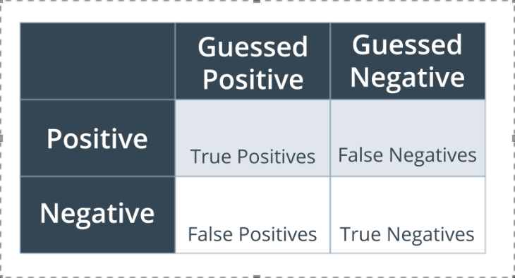
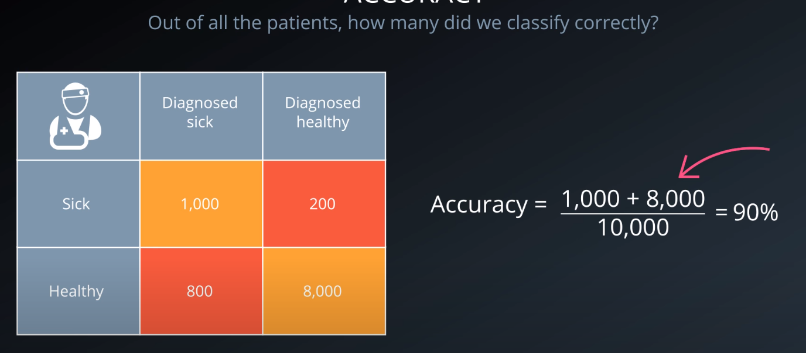
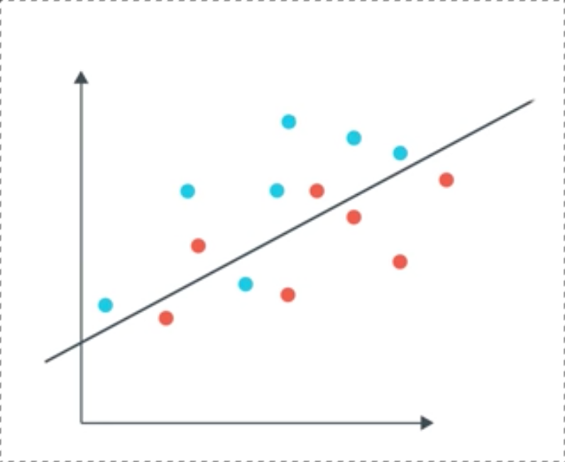
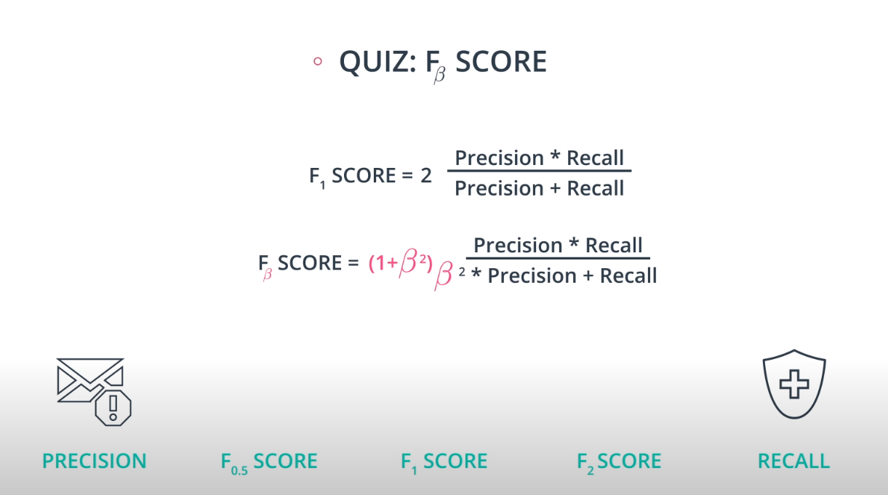
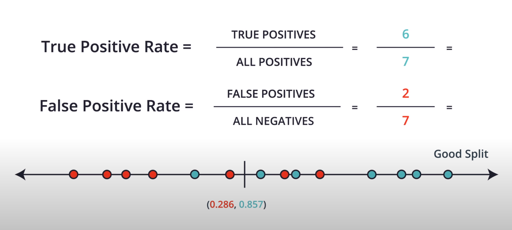
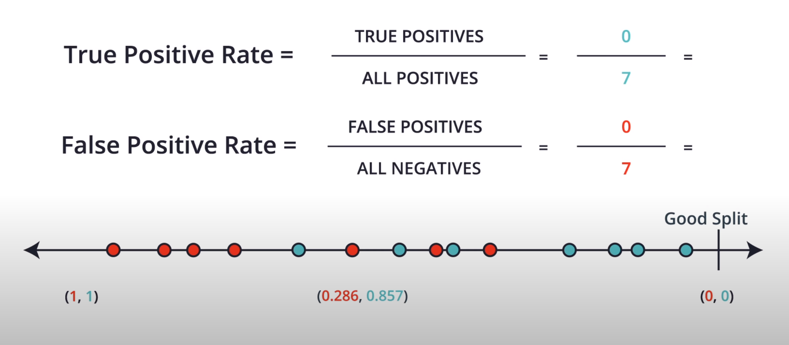
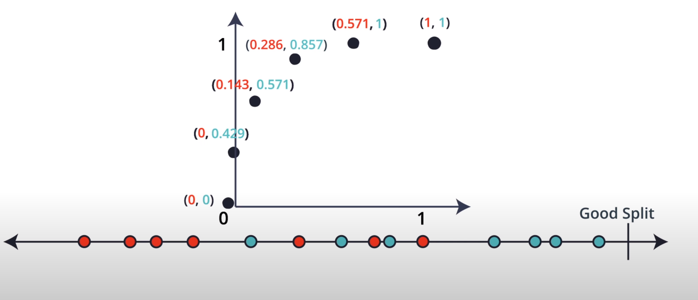
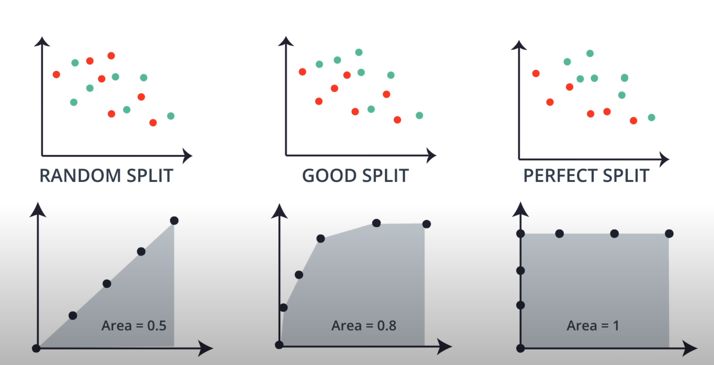

.. meta::
    :description lang=en: Collect useful snippets related to evaluating/verification model techniques
    :keywords: Python, Python3 Cheat Sheet

==============================
Evaluating a model
==============================

.. contents:: Table of Contents
    :backlinks: none

Description
------------

Techniques to evaluate model performance

Machine Learning
------------------

Common machine learning process:

- Import the model.
- Instantiate the model with the hyperparameters of interest.
- Fit the model to the training data.
- Cross validate the model to make sure it is not overfitting or underfitting. As the model gets more complex, then the training data is predicted nicely (low error), but the cross validation data has high error
    - One method is to split the data three way such that 60% is for training, 20% is for validation, and a final 20% is for
testing.

        .. image:: images/cross-validation.png
           :width: 400

    - Second method is to do K-fold cross-validation when the dataset is small. This reduces the likelihood of critical data not been used for training data (the data was moved to be validation or test data)

        .. image:: images/kfold-crossvalidation.png
           :width: 400

- Predict on the test data.
- Score the model by comparing the predictions to the actual values.

Model Summary
--------------

- Regression
    - Linear Regression

- Classification
    - Logistic Regression

- Both
    - Decision Trees, Random Forest, Adaptive boosting,

Metrics Summary
----------------

- Regression
    - Mean Square Error, Mean Absolute Error, R2 Score

- Classification
    - Precision, Recall, Accuracy, Area Under Curve

- Both

Confusion Matrix
------------------

Note: The first row in the table is the actual positive label, and
second row is the actual negative label

- Type 1 Error (Error of the first kind, or False Positive):
    - ex: medical example, misdiagnose a healthy patient as sick.
- Type 2 Error (Error of the second kind, or False Negative):
    - ex: medical example, misdiagnose a sick patient as healthy.

Accuracy
---------

Measures how often the classifier makes the correct prediction.
It’s the ratio of the number of correct predictions to
the total number of predictions (the number of test data points).

[(True Positives+True Negatives)/All points]

This score can range from 0 to 1, with 1 being the best possible score.

Ex:

Precision
----------

Measures how well the classifier made the correct predictions
in the positive region.

In other words, precision is the ratio of

[True Positives/(True Positives + False Positives)]

This score can range from 0 to 1, with 1 being the best possible score.

Ex: Out of the points we have predicted ot be positive, how many are correct? (6/8)

Recall (sensitivity)
----------------------

Measures how well the classifier made the correct predictions
in respect to all actual positive labels.

In other words, recall is the ratio of

[True Positives/(True Positives + False Negatives)]

This score can range from 0 to 1, with 1 being the best possible score.

Ex: Out of the points labeled positive, how many did we correctly predict? (6/7)

F-Score
-------------------------

The weighted average of the precision and recall scores.

- The smaller Beta --> 0 the F-score is more precision
- A Beta of 1 then the F-score is a harmonic mean of precision and recall
- The higher Beta --> infinity the F-score, the more recall

The F-score can be attenuated with the beta hyperparameter such that
score fits the datasets goal

- F-beta score 2: The model should have more recall (can't risk having false negatives)
    - Spaceship: Detecting malfunctioning parts in spaceship (a bad part can't be diagnose as malfunctioning)
    - Patient: Detecting patient is sick. (sick patients can't be diagnose as healthy)
- F-beta score 1: The model can be either. (no risk been false negative or false positive)
    - Notifications: Sending phone notifications about videos a user may like (doesn't hurt if the user gets a video he doesn't like)
- F-beta score 0.5: the model should have more precision
    - Spam: Identifying an email is spam. (can't afford to have grandma's email be spam)
    - Promotional: Sending promotional material in the main to potential clients (can't afford to send promotional material to not potential clients)

ROC Curve
-----------

Receiver Operating Characteristic (ROC) is a metric
to identify whether a model classified the data well.

To find the ROC curve, every point in the dataset needs to be
split (think of sampling the data in signal processing terms)
to create the curve. For example, in a 1 dimensional dataset, the
data is split in the most left, middle and most right.

The area under the curve is then calculated (approximated below to 0.8)

The closer the area under the ROC curve is to one,
then the better the model is.

Error Function:
-------------------
The error between the point and the point of the predicted line in the y-axis (misclassified points).
The smaller the error, the closer the predicted line is to the data

- Mean Absolute Error:
    The VERTICAL distance between the point and line, where y is the point and y hat is the point of the line.
    The absolute distance makes sure that the distance stays positive regardless of been negative.

    .. raw:: html

        

- Mean Square Error:
    The SQUARE distance between the point and line (average amount you miss by across all the points), where y is the point and y hat is the point of the line.
    The error is the average of areas of all the squares. A constant 1/2 is multiplied for convenience

    The mean squared error is by far the most used metric for optimization in regression problems
    because the quadratic term is differentiable. However, an absolute value is not differentiable. This factor makes this metric better for gradient based optimization algorithms.

    .. raw:: html

        

R2 Score
----------

The amount of variability captured by a model.

.. image:: images/r2_score.png
   :width: 400
