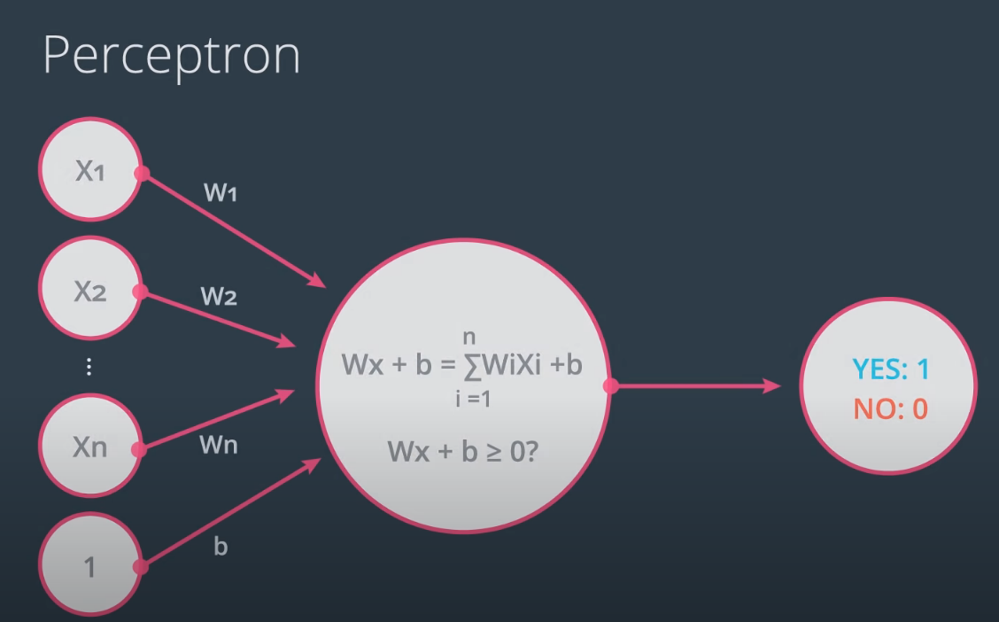

.. meta::
    :description lang=en: Notes related to the branch of classification
    :keywords: Python, Python3 Cheat Sheet

==============================
Classification
==============================

.. contents:: Table of Contents
    :backlinks: none

Definition
----------------

The aim to predict a state or category (true/false, yes/no)

Perceptron Classifier
-----------------------

The general form of the equation for a line in a 2D plane perceptron classifier is

    .. raw:: html

        

where a is the score (weight) for x1, b is the score (weight) for x2, and c is the bias.
Note that x1 and x2 are the axis of the plane where 1 and 2 are the units/datatype. The perceptron equation forms a line
that best separates the datasets

A step function can then be used to define how to turn the scores into a prediction:

    - step(x) = 1, if x >= 0, Accept
    - step(x) = 0, if x < 0, Reject

    .. raw:: html

        

Similarly, the general form of the equation for a 2D plane in a 3D plane perceptron classifier is

    .. raw:: html

        

Similarly, the general form of the equation for a n-1 dimensional hyperplane in a n-dimensional plane perceptron classifier is

    .. raw:: html

        

