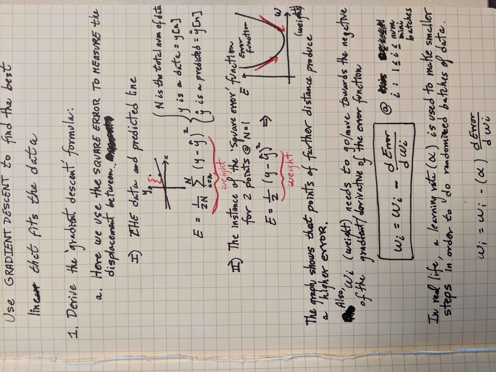
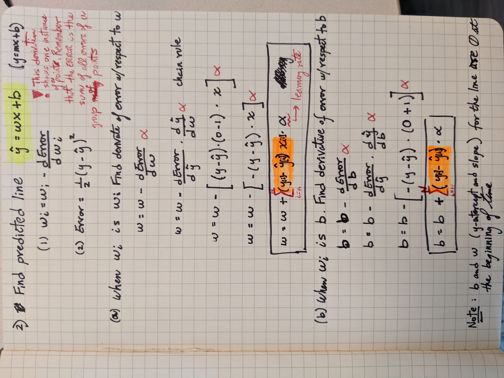

.. meta::
    :description lang=en: Notes related to find a linear regression that best fits the data
    :keywords: Python, Python3 Cheat Sheet

==============================
Linear Regression
==============================

.. contents:: Table of Contents
    :backlinks: none

Error Function:
-------------------
The error between the point and the point of the predicted line in the y-axis.
The smaller the error, the closer the predicted line is to the data

- Mean Absolute Error:
    The VERTICAL distance between the point and line, where y is the point and y hat is the point of the line.
    The absolute distance makes sure that the distance stays positive regardless of been negative.

    .. raw:: html

        

        

- Mean Square Error:
    The SQUARE distance between the point and line, where y is the point and y hat is the point of the line.
    The error is the average of areas of all the squares. A constant 1/2 is multiplied for convenience

    .. math::
     ERROR = \frac{ \sum_{i=n}^{N}(y[i]-{\hat {y}}[i])^2 }{2N}

Gradient (Derivative) Descent:
--------------------------------
The gradient descent is a method to descent from high to low error by using the derivative of the error function as the step

The gradient descent with respect to the predicted line algorithm.
NOTE that the derivative of the error with respect to w or b is highlighted in orange.
The equation shows an instance of one point. However, this is the sum of all square errors. Thus, the sum of all gradient errors as denoted in the final calculation.

Multiple Linear Regression:
---------------------------

When the outcome to predict depends on one variable,
then this is a 2 dimensional problem.
We fit a prediction line where x is the variable and y hat is the outcome:

.. math::
 {\hat {y}} = w_{1}x + w_{2}

In contrast, when the outcome to predict depends on more than one variable,
then this is a n-dimensional problem.
We fit a prediction plane (multiple lines) where x's are the variables, and y hat is the outcome:

.. math::
 {\hat {y}} = w_{1}x_{1} + w_{2}x_{2} + ... + w_{n-1}x_{n-1} + w_{n}
