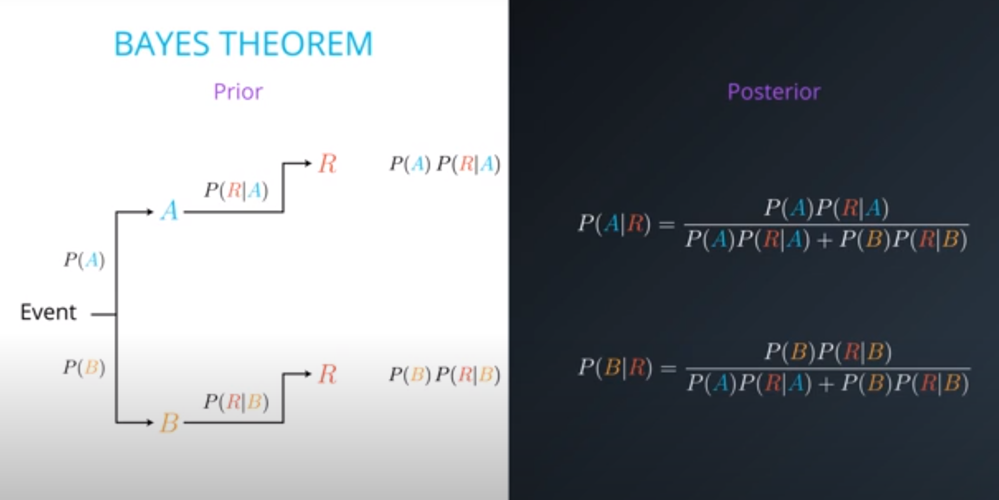
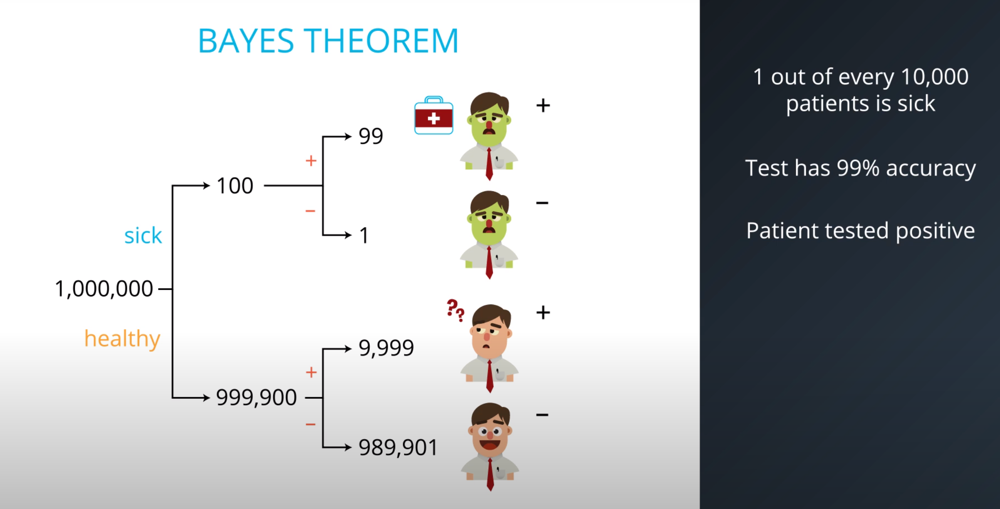

.. meta::
    :description lang=en: Notes related to Naive Bayes model
    :keywords: Python, Python3 Cheat Sheet

===============
Naive Bayes
===============

.. contents:: Table of Contents
    :backlinks: none

Definition
------------

Bayes theorem answers the question “What is the probability of Y given
that X occurred”, which is called a conditional probability.
In machine learning, this can be  rephrased to
"What is the probability of the label being positive given the features."
However, Bayes theorem on its own can get too complicated if there
are too many features.

Naive Bayes model simplifies the calculations.

Bayes Theorem
--------------

The technique to improve probability
from no information (prior) to more information (posterior)

- PRIOR The initial probability. Probability of R given A, and Probability of R given B

- EVENT Something that occurs, which gives us information.

- POSTERIOR The final (and more accurate) probability that we calculate using the prior probability and the
event. Probability of A given R, and Probability of B given R

