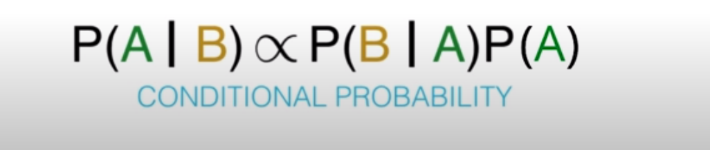

.. meta::
    :description lang=en: Notes related to Naive Bayes model
    :keywords: Python, Python3 Cheat Sheet

===============
Naive Bayes
===============

.. contents:: Table of Contents
    :backlinks: none

Definition
------------

Bayes theorem answers the question “What is the probability of Y given
that X occurred”, which is called a conditional probability.
In machine learning, this can be  rephrased to
"What is the probability of the label being positive given the features."
However, Bayes theorem on its own can get too complicated if there
are too many features.

Naive Bayes model simplifies the calculations.

Bayes Theorem
--------------

The technique to improve probability
from no information (prior) to more information (posterior)

- PRIOR The initial probability. Probability of R given A, and Probability of R given B

- EVENT Something that occurs, which gives us information.

- POSTERIOR The final (and more accurate) probability that we calculate using the prior probability and the
event. Probability of A given R, and Probability of B given R

.. image:: examples/bayes_theorem/bayes_theorem.png
   :width: 800

.. image:: examples/bayes_theorem/probability_of_patient_test_positive.png
   :width: 800

Naive Bayes
--------------

Naive Bayes' is an extension of Bayes' theorem
that assumes that all the features are independent of each other.
It calculates the probability of a certain event
happening based on the joint
probabilistic distributions of more than one features.

- 1. Conditional Probability to calculate the value proportional probability where P(A|B) is the posterior probability, and A is the event, and B can be multiple features:

- 2. Normalizing is done by adding all the class variables (events) y and then taking the ratio of an instance of a class variable y. Below is the entire equation for one y instance with normalization done between 0-1. The equation below shows A as y, and B as x:

.. raw:: html

    

- 2.a. The equation below is the sum of all y instances. This is used on the equation above in order to be able to normalize

.. raw:: html

    <img src="https://render.githubusercontent.com/render/math?math=P(x_1,...,x_n)=\sum_{i=0}^{N}P(y_i)P(x_1,...,x_n | y_i)=\sum_{i=0}^{N}P(y_i)P(x_1 | y_i)P(x_2 | y_i)...P(x_n | y_i)"