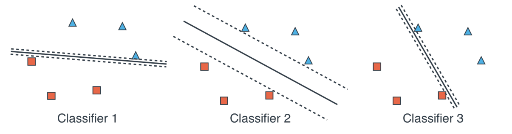
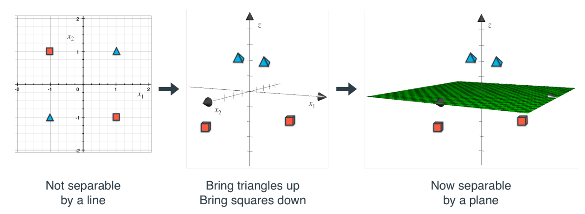

.. meta::
    :description lang=en: Notes related to Support Vector Machines and Kernel Method
    :keywords: Python, Python3 Cheat Sheet

=================================================
Support Vector Machines (SVM) and Kernel Method
=================================================

.. contents:: Table of Contents
    :backlinks: none

Definition
------------

SVM is another type of classification model (similar to the perceptron model,
which uses a linear boundary to separate the dataset). However, SVM
finds a line boundary that is located as far as possible form the points in the
dataset with the aid of two parallel lines. The image below shows that
classifier 2 is the desired one.

The kernel method can be coupled with an SVM to classify datasets using
non-linear boundaries.

SVM
----

SVM is a technique used to separate data that can be done with a linear boundary.

The goal is to minimize the error function by using gradient descent
in order to maximize classification and distance between the lines

.. raw:: html

    

- Classification Error

    Penalizes points that are misclassified. This technique attempts to classify the points correctly.

    The classification error is the absolute sum of y from points that fall
    on the incorrect area of the classification line. In this example,
    blue points that fall on the red area, and red points that fall on the
    blue area.

    .. image:: examples/support_vector_machines/classification_error_1.png
       :width: 400

    .. image:: examples/support_vector_machines/classification_error_2.png
       :width: 400

- Margin Error:

    Penalizes lines that are too close to each other. This technique attempts to separate the two lines as far apart as possible.

    The margin error is identical to L2 normalization regularization.
    The sum of the square of the coefficients with the exception of the constant coefficient.

    .. image:: examples/support_vector_machines/marginError.png
       :width: 400

    .. image:: examples/support_vector_machines/marginError2.png
       :width: 400

- C parameter:

    The C parameter (hyperparameter) is used to attenuate the outcome. It is defined as

    .. raw:: html

        

    - Large C will penalize the classification error. Therefore, the model needs to work harder to classify the points, and thus produce better classification.

    - Small C will not penalize the classification error as much. Therefore, lead to more chance of error.

    .. image:: examples/support_vector_machines/c-parameter.png
       :width: 400

Kernels
---------

Kernels is a technique used to separate data that can only be done with a non-linear boundary.

The image below shows a point (x1,x2) send to a point in (x1,x2,x1*x2) space.

- Polynomial Kernel

    The use of polynomial equations such as circles, parabolas, hyperbolae, etc to model non-linear datasets.

    .. image:: examples/support_vector_machines/kernels/circle_polynomial.png
       :width: 400

    - monomials of degree degree 2 containing x1 and x2 axis:

        - x3
        .. raw:: html

            

        - x4
        .. raw:: html

            

        - x5
        .. raw:: html

            

    - monomials of degree degree 3 containing x1 and x2 axis:

        - x3
        .. raw:: html

            

        - x4
        .. raw:: html

            

        - x5
        .. raw:: html

            

        - x6
        .. raw:: html

            

        - x7
        .. raw:: html

            

        - x8
        .. raw:: html

            

        - x9
        .. raw:: html

            

- Radial Basis Function (RBF) Kernel

    The use of radial basis functions centered at each of the data points in order
    to model non-linear datasets.

    .. image:: examples/support_vector_machines/kernels/rbf_technique.png
       :width: 400

    .. image:: examples/support_vector_machines/kernels/rbf_technique2.png
       :width: 400

    - One dimensional points in x-axis requires a 2 dimensional function:

        - 2 dimensional function:

        .. raw:: html

            

        .. image:: examples/support_vector_machines/kernels/guassian_distribution.png
           :width: 400

        - Move maximum point to point p, ex: 5

        .. raw:: html

            

    - Two dimensional points (x,y) requires a 3 dimensional function:

        - 3 dimensional function:

        .. raw:: html

            

        .. image:: examples/support_vector_machines/kernels/guassian_distribution_3d.png
           :width: 400

        - Move maximum point to point (p,q), ex: (2,-3)

        .. raw:: html

            

    - n dimensional points requires a n+1 dimensional function:

        - n+1 dimensional function

        .. raw:: html

            

        - Move maximum point to point (p1,...,pn)

        .. raw:: html

            

    - Similarity technique

        The notion of similarity can be used to translate points into a higher dimension.
        For example, in a 1 dimensional point distance p and q, then

        .. raw:: html

            

        Therefore, similarity is the output of the height of a point in the radial basis function. As distance increases, similarity decreases and vice versa..

    - y-gamma hyperparameter

    .. image:: examples/support_vector_machines/kernels/y_gamma_param.png
       :width: 400